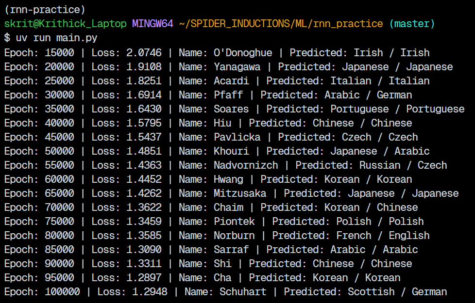
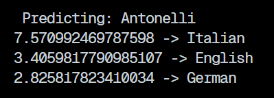
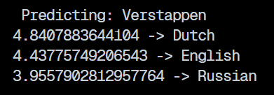
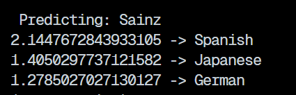

(Just some notes I took, results of model at end)

## Why rnn?

Basically when we've got sequential data (in this case, text), the length, size or nature of the data might not be known. Hence we use rnns so that we can look at the data one by one and store it in internal memory. It updates the memory as it moves through the data. This however used higher computational power.

## rnn with the example of names

Suppose we have a very dutch name, `Aalst`.

Instead of looking at the whole word, rnn uses a loop:
  - It looks at the first letter `A`
  - It generates internal memory about it
  - It combines it with it's existing memory
  - It repeats till it reaches the end

_It basically reads the word letter-by-letter_

This memory acts as a 'summary' of the name. It then uses this in order to guess the language.

## Structure of the rnn

Inside all the complex stuff, rnn is just 2 linear layers combined at each step.

At any given time-step _`t`_ (corresponding to a letter) the rnn takes 2 inputs:
  - Current length ( $x_t$ )
  - Hidden state ( $h_{t-1}$ )

```
(!) Note that the letters have to be one-hot-encoded before passing into the rnn
```

## How does it update the hidden state?

$$h_t = \tanh(W_{ih} x_t + b_{ih} + W_{hh} h_{t-1} + b_{hh})$$

  - $W_{ih}$ and $W_{hh}$: These are the Weights
  - $b_{ih}$ and $b_{hh}$: These are the Biases
  - $\tanh$: This is the Activation Function

Once this hidden state is calculated, it can:
  - Be passed into the next step of the loop
  - Be passed into a linear layer to produce output

## Output:

  - Training:

  
  - Prediction for `Antonelli` <br />


  - Prediction for `Verstappen` <br />


  - Prediction for `Sainz` <br />


* Note that these names may/may not be in the trained data. `Verstappen` and `Sainz` weren't in the dataset as a whole. The model is trained over 100k randomly selected names. _The names I predicted are f1 racecar drivers_
      